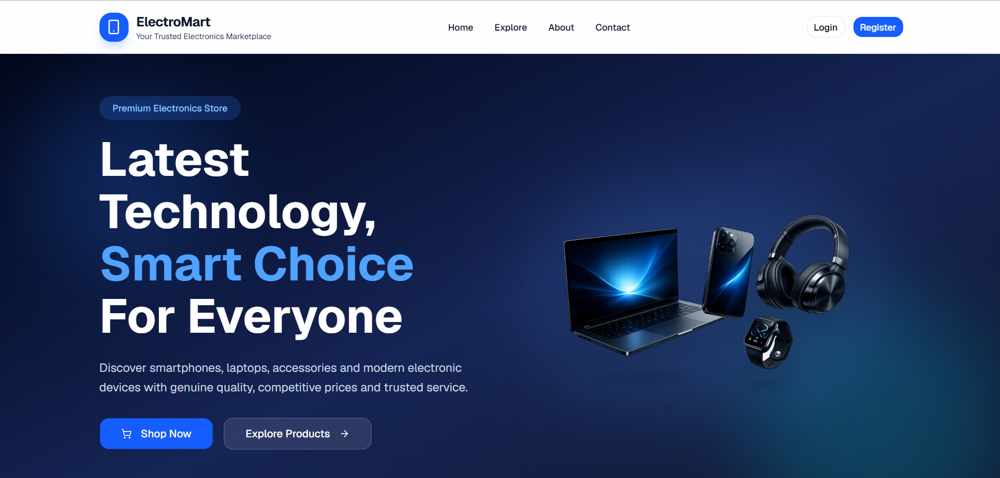
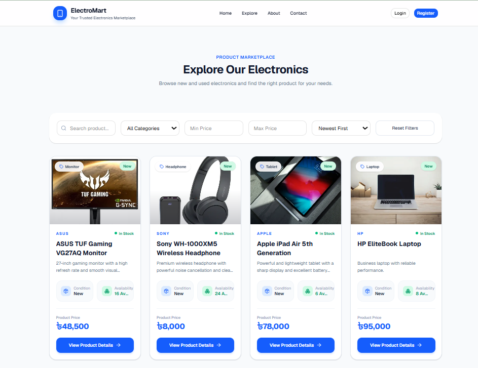
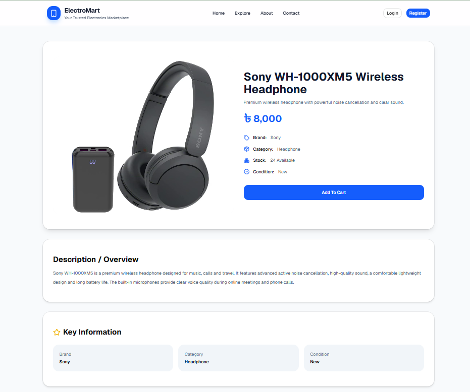
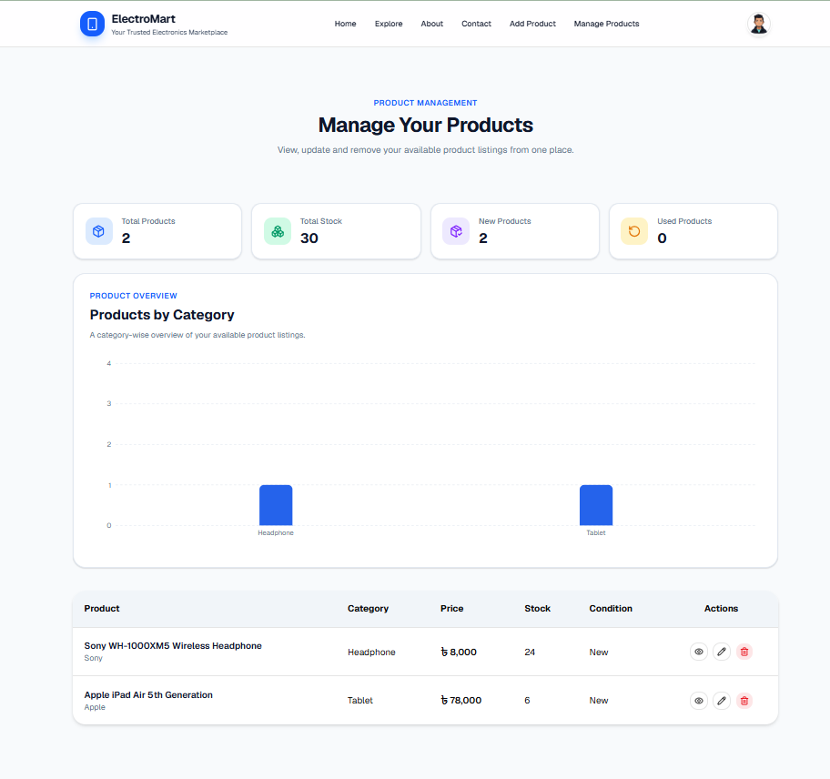

# ElectroMart

> **Your Trusted Electronics Marketplace**

ElectroMart is a modern full-stack electronics marketplace where users can discover, list, and manage electronic devices through a secure, responsive, and user-friendly web application.

Visitors can explore products, search and filter listings, view detailed product information, and browse related items. Authenticated users can add products and securely manage only the listings they created.

## Live Links

- **Live Website:** https://electromart-beta.vercel.app/
- **Client Repository:** https://github.com/nahidforever/ElectroMart-Client
- **Server Repository:** https://github.com/nahidforever/ElectroMart-Server

## Project Overview

ElectroMart was developed as a production-ready TypeScript full-stack application to demonstrate:

- Frontend development with Next.js
- Backend API development with Node.js and Express.js
- MongoDB database management
- JWT-based authentication and authorization
- Secure ownership-based product management
- Search, filtering, sorting, and pagination
- Responsive UI/UX design
- Data visualization using Recharts


## Key Features

### Public Features

- Responsive landing page with at least seven meaningful sections
- Sticky and responsive navigation bar
- Product exploration page
- Search by product title, brand, or description
- Category and price-range filtering
- Sorting by newest, lowest price, and highest price
- Server-side product pagination
- Public product details page
- Related product recommendations
- About and Contact pages
- Functional contact form
- Custom 404 page
- Responsive footer with contact and social links
- Skeleton loaders while product data is loading

### Authentication Features

- User registration
- User login
- Form validation and error handling
- JWT-based protected API access
- Protected Add Product and Manage Products routes
- Unauthorized-user redirection

### Authenticated User Features

- Add electronic products
- View personal profile
- View personal product statistics
- View category-wise product analytics
- Manage personally added products
- Edit owned products
- Delete owned products
- Open product details from the management table

### Security and Authorization

- JWT verification through remote JWKS
- Product ownership stored using `ownerId`
- Ownership validation during listing, update, and deletion
- Users cannot update or delete products created by another user
- Authorization is enforced by the backend, not only by the frontend

## Technology Stack

### Frontend

- Next.js
- React
- TypeScript
- Tailwind CSS
- Recharts
- Lucide React
- Sonner
- Better Auth

### Backend

- Node.js
- Express.js
- TypeScript
- MongoDB
- JWT
- JOSE
- CORS
- Dotenv


## Main Routes

| Route              | Access    | Description                               |
| ------------------ | --------- | ----------------------------------------- |
| `/`                | Public    | Home page                                 |
| `/explore`         | Public    | Search, filter, sort, and browse products |
| `/products/[id]`   | Public    | Product details page                      |
| `/about`           | Public    | Information about ElectroMart             |
| `/contact`         | Public    | Contact and support page                  |
| `/login`           | Public    | User login                                |
| `/register`        | Public    | User registration                         |
| `/products/add`    | Protected | Add a product                             |
| `/products/manage` | Protected | Manage the logged-in user's products      |


## Product Management Workflow

1. A user registers or logs in.
2. The authenticated user submits the Add Product form.
3. The backend verifies the JWT.
4. The product is stored with the authenticated user's `ownerId`.
5. The Manage Products page fetches only products belonging to that user.
6. Update and delete requests must match both the product ID and owner ID.

This ensures that every user can manage only their own products.


## Product Data Model

```ts
interface Product {
  _id: string;
  title: string;
  brand: string;
  category: string;
  price: number;
  stock: number;
  condition: "New" | "Used";
  shortDescription: string;
  description: string;
  image: string;
  ownerId: string;
  createdAt: Date;
  updatedAt: Date;
}
```


## API Endpoints

### Public APIs

| Method | Endpoint                          | Description                                                  |
| ------ | --------------------------------- | ------------------------------------------------------------ |
| `GET`  | `/products`                       | Get products with search, filtering, sorting, and pagination |
| `GET`  | `/products/:id`                   | Get one product                                              |
| `GET`  | `/products/related/:category/:id` | Get related products                                         |
| `POST` | `/contact-messages`               | Submit a contact message                                     |

### Protected APIs

| Method   | Endpoint               | Description                           |
| -------- | ---------------------- | ------------------------------------- |
| `POST`   | `/manage/products`     | Add a product                         |
| `GET`    | `/manage/products`     | Get the authenticated user's products |
| `PATCH`  | `/manage/products/:id` | Update an owned product               |
| `DELETE` | `/manage/products/:id` | Delete an owned product               |


## Search, Filtering, Sorting, and Pagination

The Explore page supports:

- Keyword search
- Category filtering
- Minimum price filtering
- Maximum price filtering
- Newest-first sorting
- Price: low to high
- Price: high to low
- Server-side pagination


## Data Visualization

The Manage Products page includes a responsive Recharts dashboard showing:

- Total products
- Total stock
- New products
- Used products
- Product distribution by category

The chart uses a mobile-friendly horizontal layout and a desktop vertical layout.


## Responsive Design

ElectroMart is optimized for:

- Mobile devices
- Tablets
- Laptops
- Desktop screens

The interface maintains consistent colors, spacing, typography, card styles, border radii, and interactive states.

## Application Screenshots

### Home Page



### Explore Products



### Product Details



### Manage Products Dashboard




## Local Installation

### Prerequisites

- Node.js
- npm
- MongoDB Atlas account
- Git

### Clone the Project

```bash
git clone https://github.com/nahidforever/ElectroMart-Client
cd YOUR_PROJECT_FOLDER
```

## Frontend Setup

```bash
cd client
npm install
```

Create `.env`:

```env
NEXT_PUBLIC_SERVER_URI=http://localhost:5000
BETTER_AUTH_SECRET=your_auth_secret
BETTER_AUTH_URL=http://localhost:3000
```

Run the frontend:

```bash
npm run dev
```

Frontend URL:

```text
http://localhost:3000
```

## Backend Setup

```bash
cd server
npm install
```

Create `.env`:

```env
PORT=5000
MONGODB_URI=your_mongodb_connection_string
CLIENT_URL=http://localhost:3000
```

Run the backend:

```bash
npm run dev
```

Backend URL:

```text
http://localhost:5000
```

## Environment Variables

### Frontend

| Variable                 | Purpose                 |
| ------------------------ | ----------------------- |
| `NEXT_PUBLIC_SERVER_URI` | Backend API base URL    |
| `BETTER_AUTH_SECRET`     | Authentication secret   |
| `BETTER_AUTH_URL`        | Authentication base URL |

### Backend

| Variable      | Purpose                                 |
| ------------- | --------------------------------------- |
| `PORT`        | Backend port                            |
| `MONGODB_URI` | MongoDB connection string               |
| `CLIENT_URL`  | Allowed frontend origin and JWKS source |

Never commit `.env` files.


## Available Scripts

### Frontend

```bash
npm run dev
npm run build
npm run start
npm run lint
```

### Backend

```bash
npm run dev
npm run build
npm run start
```

## Suggested Project Structure

```text
electromart/
├── client/
│   ├── public/
│   │   └── screenshots/
│   ├── src/
│   │   ├── app/
│   │   ├── components/
│   │   ├── lib/
│   │   └── types/
│   └── package.json
├── server/
│   └──index.ts
│   └── package.json
└── README.md
```

## Future Improvements

- Multiple product image uploads
- Product reviews and ratings
- Wishlist
- Shopping cart and checkout
- Seller profiles
- Admin dashboard
- Product approval workflow
- Cloud image storage
- Email notifications
- Advanced marketplace analytics

## Author

**Your Name**

- GitHub: https://github.com/nahidforever
- LinkedIn: https://www.linkedin.com/in/nahidforever/
- Email: n.i.nahid02@gmail.com


## License

This project was developed for educational and portfolio purposes.
